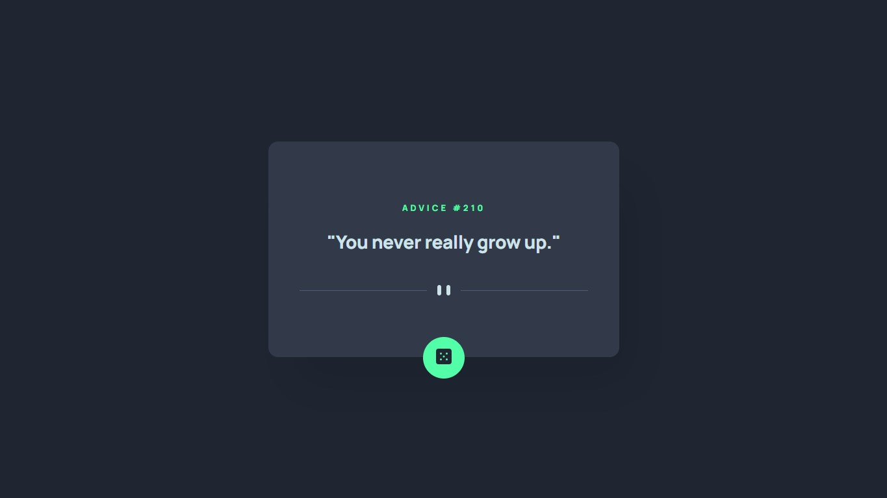

# Exercício CSS Avançado Flexbox - App Gerador de conselhos

## Sobre o Projeto

O principal desafio é construir um aplicativo que gere conselhos aleatórios. Nessa primeira etapa do exercício, será realizado apenas a construção do HTML e CSS.

## Tecnologias Utilizadas

                 
## Imagens do Projeto

### Desktop

### Mobile

